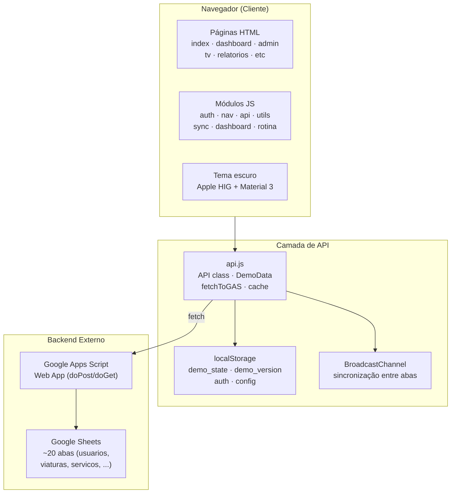
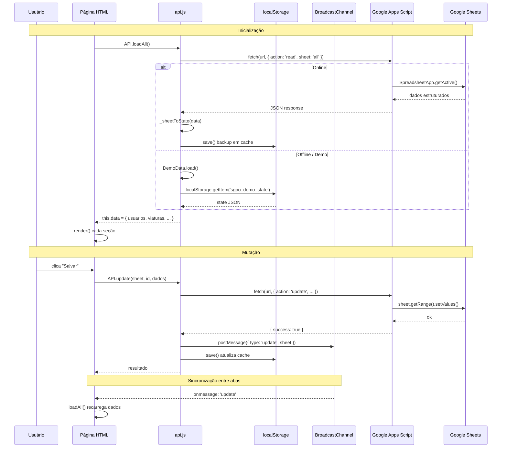
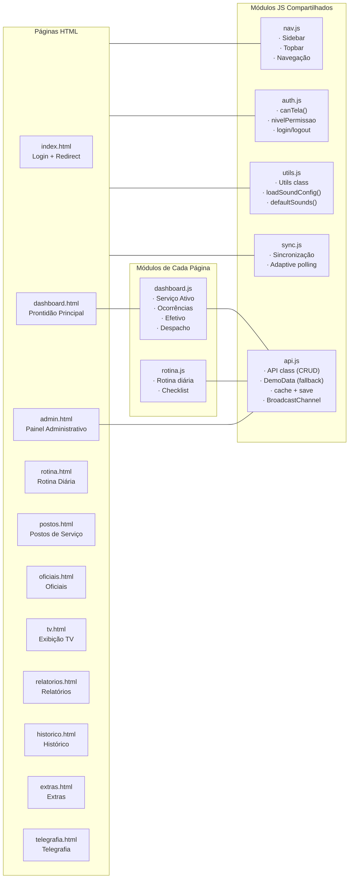

# Diagramas do SGPO

## 1. Arquitetura Geral

## 2. Fluxo de Dados

## 3. Estrutura de Módulos

## 4. Modelo de Dados

```mermaid
erDiagram
    usuarios ||--o{ permissoesTela : "tem permissões"
    usuarios {
        string id PK
        string usuario
        string nome
        string senha
        string perfil "operador | admin | superadmin"
        string nivelPermissao "POSTO | SGB | GB"
        string Status "ativo | removido"
    }

    militares {
        string id PK
        string nome
        string reCpf
        string posto
        string Status
    }

    oficiais {
        string id PK
        string nome
        string posto
        int antiguidade
        string unidade
        string Status
    }

    postos {
        string id PK
        string nome
        string ordem
        string Status
    }

    permissoesTela {
        string id PK
        string tela
        string perfil
        string nivelMinimo
        string Status
    }

    viaturas ||--o{ ocorrencias : "despachada em"
    viaturas {
        string id PK
        string nome
        string tipo "UR | ABT | etc"
        string placa
        string capacidade
        string Status
    }

    tiposViatura {
        string id PK
        string nome
        string sigla
        string Status
    }

    naturezas {
        string id PK
        string nome
        string valor
        string Status
    }

    servicos ||--o{ ocorrencias : "contém"
    servicos ||--o{ efetivo_escala : "escala"
    servicos {
        string id PK
        string data
        string horaInicio "07:30"
        string horaFim "07:30+1"
        string corProntidao "verde | amarela | azul | branca"
        string status "ativo | encerrado"
        string Status
    }

    ocorrencias {
        string id PK
        string servicoId FK
        int numero
        string titulo
        string natureza FK "ref. naturezas"
        string descricao
        string viaturaIds "array de IDs"
        string efetivo "array de nomes"
        time horaAcionamento
        time horaRetorno
        string prontidaoCor
        string status "em_atendimento | concluida"
        string Status
    }

    atividades {
        string id PK
        string nome
        string descricao
        string Status
    }

    configuracoes {
        string id PK
        string chave
        string valor
        string Status
    }

    sons {
        string id PK
        string nome
        string url
        string tipo "alerta | notificacao | etc"
        string Status
    }

    logos {
        string id PK
        string nome
        string url
        string Status
    }
```

## Legenda

| Cor | Nível de Prontidão |
|-----|-------------------|
| 🟢 Verde | Normal |
| 🟡 Amarela | Atenção |
| 🔵 Azul | Reforço |
| ⚪ Branca | Máxima |

- **Superuser**: `cavalieri` / `tricolor` (id `_superuser_`, perfil `superadmin`)
- **Turno**: 24h (07:30 às 07:30)
- **Fallback offline**: DemoData com localStorage
- **Host**: Vercel (frontend estático)
- **Backend**: Google Apps Script + Google Sheets (~20 abas)
